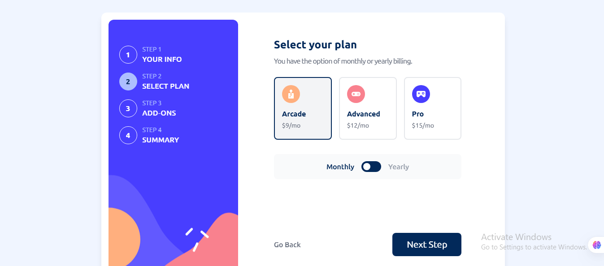

# Frontend Mentor - Multi-step form solution

This is a solution to the [Multi-step form challenge on Frontend Mentor](https://www.frontendmentor.io/challenges/multistep-form-YVAnSdqQBJ). Frontend Mentor challenges help you improve your coding skills by building realistic projects.

## Table of contents

- [Overview](#overview)
  - [Screenshot](#screenshot)
  - [Links](#links)
- [My process](#my-process)
  - [Built with](#built-with)
  - [What I learned](#what-i-learned)
  - [Continued development](#continued-development)
  - [Useful resources](#useful-resources)
- [Author](#author)

## Overview

A complete Multi-step form using React with input validation

### Screenshot



### Links

- Solution URL: [Github Solution Repo](https://github.com/Yaseeru/multi-step-form)
- Live Site URL: [Netlify Live URL](https://multi-step-form-solution1.netlify.app)

## My process

I used React to create the entire structure and then styled it with tailwind css.

### Built with

- React (Vite)
- Tailwind CSS

### What I learned

```js
const renderCurrentStep = () => {
  if (isSubmitted) {
    return <ThankYou formData={formData} />;
  }
  const CurrentStepComponent = steps[currentStep - 1].component;
  return (
    <CurrentStepComponent
      formData={formData}
      setFormData={setFormData}
      errors={errors}
      setErrors={setErrors}
      onNavigateToStep={setCurrentStep}
    />
  );
};
```

### Continued development

Improve responsiveness especially on tablet sized devices.

### Useful resources

Claude AI

## Author

- Website - [Abdulhamid Abdullahi Sulaiman](https://www.your-site.com)
- Frontend Mentor - [@Yaseeru](https://www.frontendmentor.io/profile/Yaseeru)
- Github - [@Yaseeru](https://www.github.com/Yaseeru)
